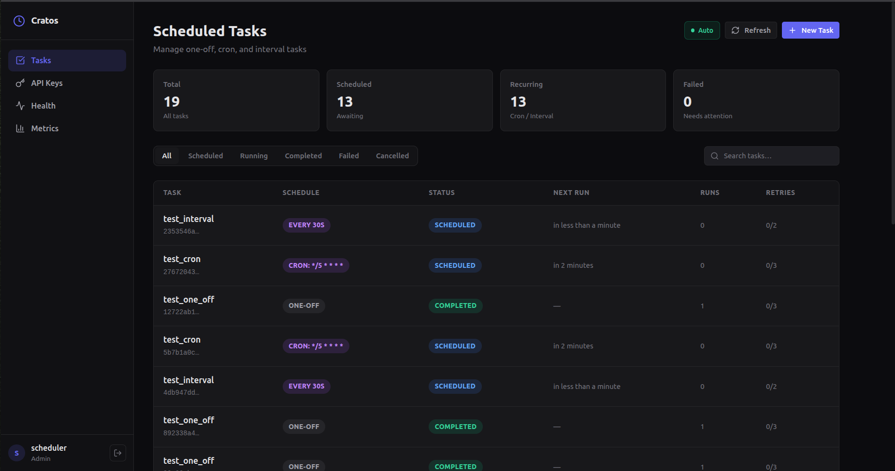
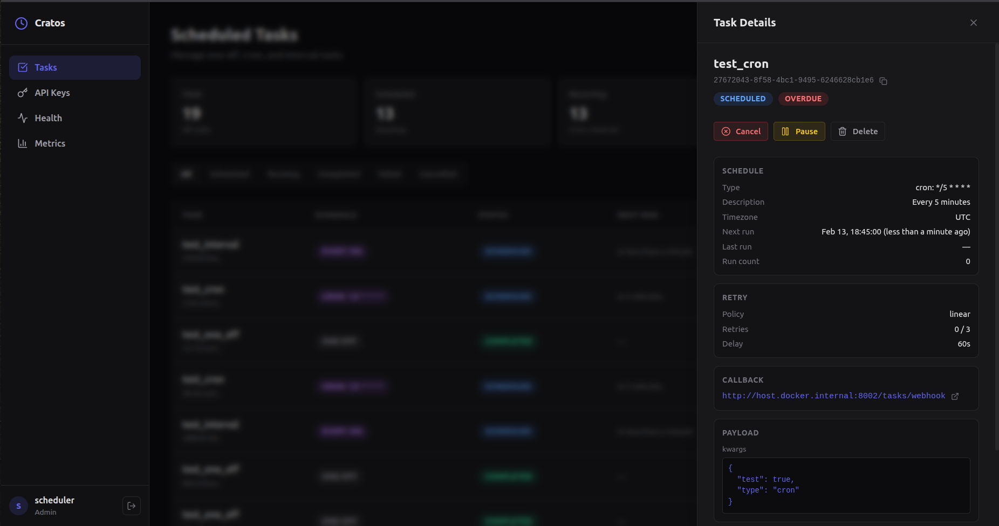
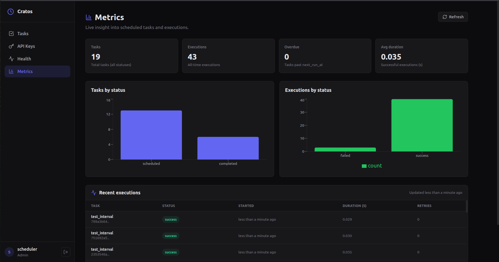

# Cratos UI

<div align="center">

**A modern, responsive web interface for the Cratos task scheduler**

[](https://opensource.org/licenses/MIT)
[](https://reactjs.org/)
[](https://www.typescriptlang.org/)

</div>

---

## Overview

Cratos UI is a modern web interface for managing and monitoring tasks in the Cratos scheduler. Built with React, TypeScript, and Tailwind CSS, it provides an intuitive way to create, schedule, and monitor background jobs.

## Screenshots

### Tasks Dashboard


### Task Details


### Metrics Dashboard


## Features

- **Task Management** - View, create, edit, and delete tasks with pagination and filtering
- **Dashboard & Metrics** - Real-time task statistics, execution history charts, and service health monitoring
- **Flexible Scheduling** - One-off tasks, cron expressions, and interval-based scheduling with timezone support
- **Task Controls** - Pause/resume, cancel, retry, and view execution history
- **Modern UI/UX** - Clean, responsive design with real-time updates and overdue task indicators
- **Authentication** - Secure login system and API key management

## Quick Start

### Prerequisites

- Docker and Docker Compose
- Cratos backend running (see [Cratos](https://github.com/Ghiles1010/Cratos))

### First Time Setup

1. **Clone the repository**
   ```bash
   git clone https://github.com/Ghiles1010/Cratos-UI.git
   cd Cratos-UI
   ```

2. **Build and start**
   ```bash
   docker compose build
   docker compose up -d
   ```

3. **Access the UI**
   - Open http://localhost:3001
   - Login with your Cratos credentials

### Environment Configuration

Set the Cratos API URL (optional, defaults to http://localhost:8001):

```bash
export VITE_SCHEDULER_API_URL=http://your-cratos-api:8001
docker compose build
docker compose up -d
```

### Service Management

```bash
docker compose up -d      # Start service
docker compose down       # Stop service
docker compose logs -f    # View logs
docker compose restart    # Restart service
```

## Development

### Local Development

```bash
npm install
npm run dev
```

The UI will be available at http://localhost:3001

## Related Projects

- **[Cratos](https://github.com/Ghiles1010/Cratos)** - Backend task scheduler service
- **[Cratos SDK](https://github.com/Ghiles1010/Cratos-SDK)** - Python SDK for easy integration

## License

MIT License - see [LICENSE](LICENSE) file for details.
